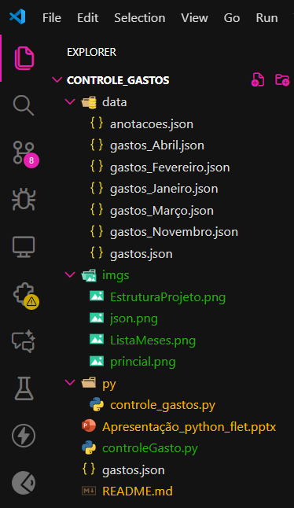

# 💸 Controle de Gastos Mensal — Flet para estilizar.

Uma aplicação moderna e intuitiva desenvolvida em **Python + Flet** para controle mensal de gastos, permitindo cadastrar salário, limite mensal, adicionar despesas, visualizar saldo restante e alternar entre meses.  
Tudo é salvo em arquivos JSON, garantindo persistência simples e leve sem necessidade de banco de dados.

---

## 📌 Funcionalidades

### ✔️ Controle financeiro
- Cadastro de **salário mensal**
- Definição de **limite de gastos**
- Adição de **gastos com nome + valor**
- Exclusão de itens da tabela
- Resumo automático:
  - Total gasto
  - Saldo restante (verde/positivo, vermelho/negativo)

### ✔️ Organização por mês
- Drawer lateral com os 12 meses
- Cada mês possui seu próprio arquivo de dados
- Alternar entre meses muda todos os dados na hora

### ✔️ Interface
- Layout estilizado em Rosa Pastel
- Tela responsiva
- Alertas e diálogos personalizados, ao ultrapassar o limite estipulado, aparece a seguinte mensagem:
  - “Limite ultrapassado”
  - Confirmação de limite

### ✔️ Armazenamento automático
- Todos os dados ficam em `data/`
- Cada mês gera um arquivo como:

- data/gastos_Janeiro.json

---

## Layout da Aplicação (Flet)
- AppBar com menu lateral
- Campos de entrada organizados
- Tabela estilizada de gastos
- Cores suaves (rosa claro e cinza)

---

## Estrutura de pastas

📦 estrutura-do-projeto
- ┣ data - JSONs com os gastos por mês
- ┣ py - controle_gastos.py # Código principal
- ┗ README.md



---

## Como executar?

### 1️⃣ Instale o Flet
```bash
pip install flet

Execute o projeto
python controle_gastos.py
```

## Tecnologias usadas

- Python 
- Flet (interface gráfica)
- JSON (persistência dos dados)
- OS / Datetime (auxiliares do sistema)


### Desenvolvido por Kaylane Coutinho.
- Focado em simplicidade, estética e controle financeiro inteligente.


- Principal objetivo - Trabalho Universitário.

